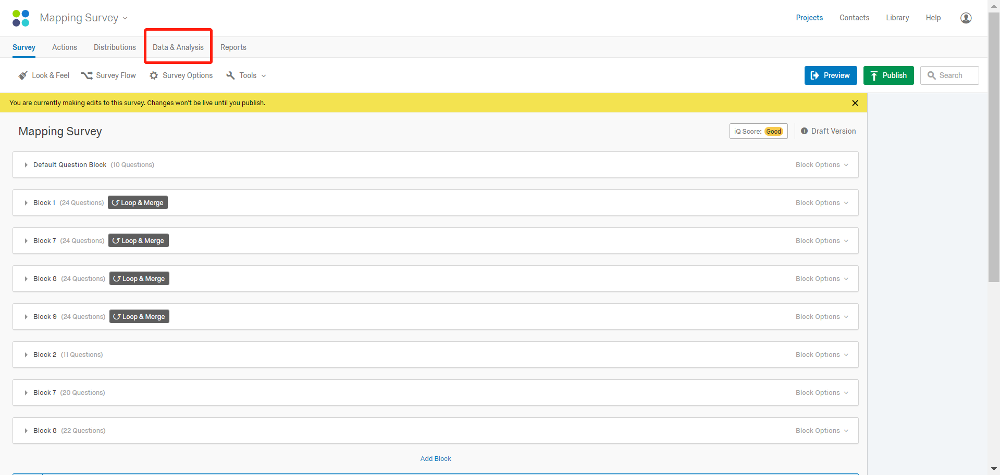
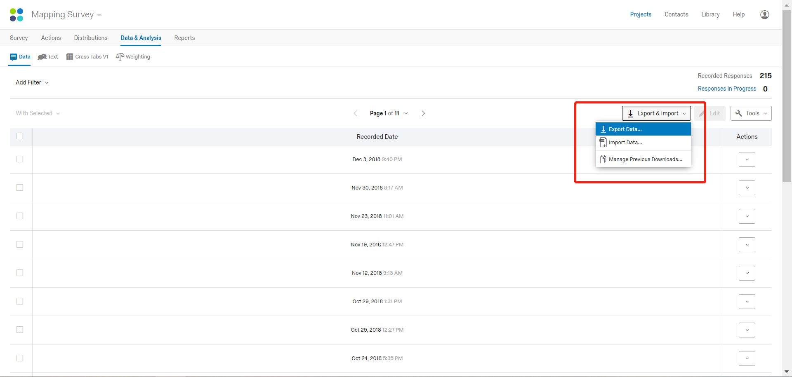
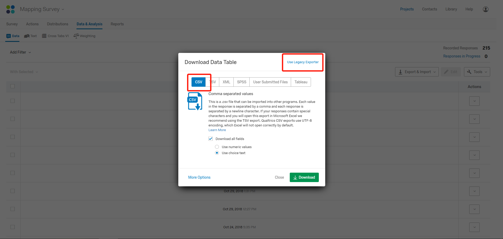
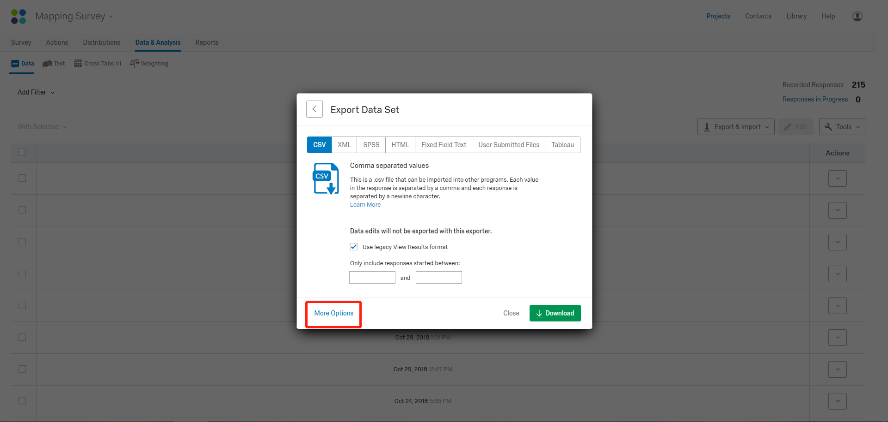
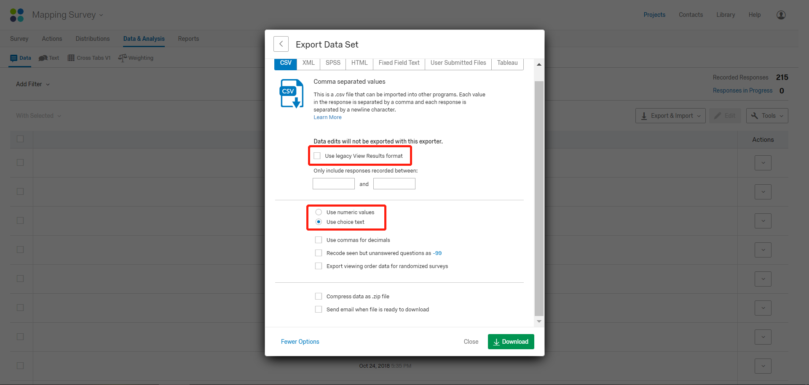
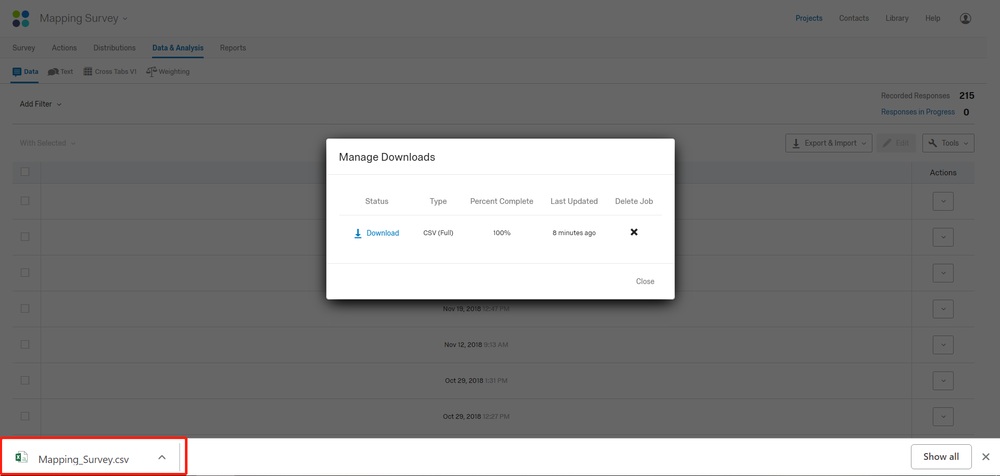
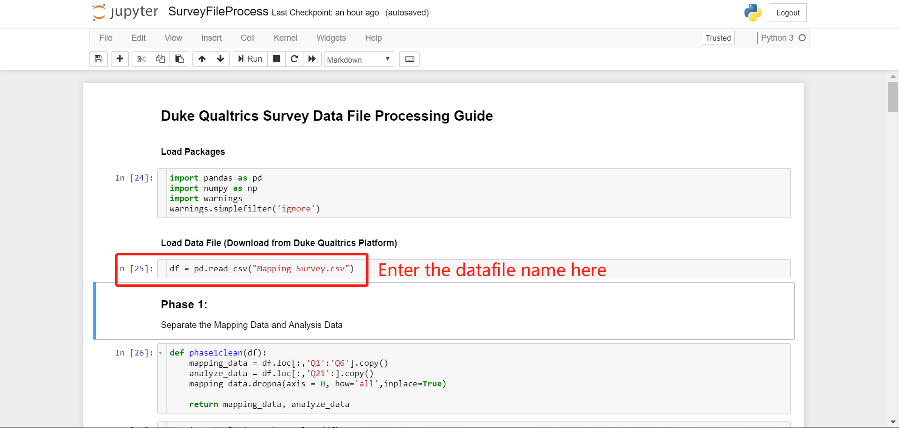
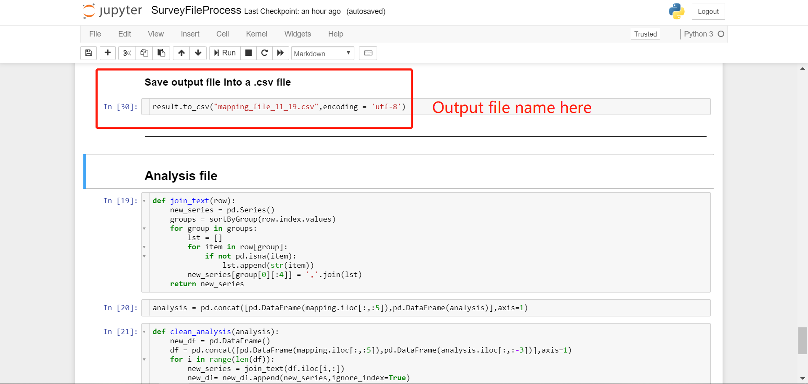
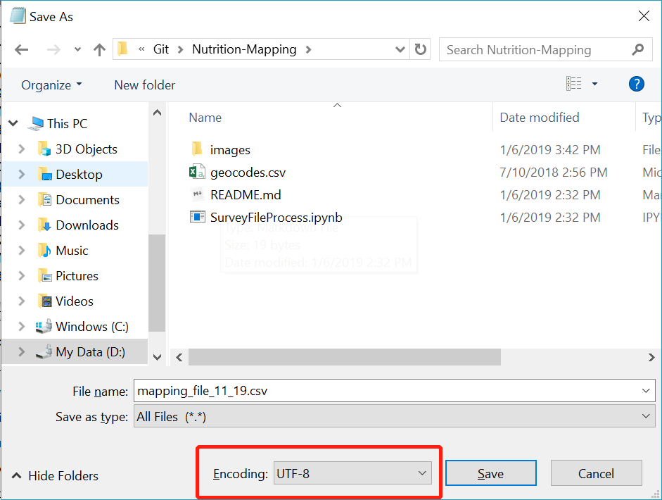

## Nutrition Mapping Survey Data Processing Guide

This is a Python Jupyter notebook used to process the survey data exported from Duke Qualtrics Platform. The survey is designed to collect information from organizations in Guatemala dedicating resources to solve the malnutrition crisis. 

The processed data is used to create an interactive map with ArcGIS to demonstrate the distribution and contributions of different organizations in Guatemala. [Interactive Map](http://www.sesan.gob.gt/wordpress/informacion/conectateguate/)

https://www.researchgate.net/publication/359408850_Mapping_Nutrition_Interventions_in_Guatemala_To_Identify_Opportunities_to_Improve_Coverage_and_Coordination

---

#### Required Software

Jupyter Notebook for Python 3.6, required packages: numpy, pandas

---

#### Step 1: Export Data from Duke Qualtrics Platform

Once accessed the back stage of the survey, click on the `Data & Analysis` tab.

Click `Export Data`

Select `CSV` file format and click `Use Legacy Exporter` at the right upper corner.

Click `More Options`

Uncheck the option `Use legacy View Results format` and select `Use Choice Text`

Click `Download`

Successfully downloaded the original datafile from Duke Qualtrics!!

---

#### Step 2: Process Data with the Notebook

Move the downloaded datafile, for example `Mapping_Survey.csv`, to the same directory as the Jupyter Notebook `SurveyFileProcess.ipynb` and the Geocode file `geocodes.csv`.

Open Notebook and enter the datafile name into the corresponding code cell.

Run the code in the Notebook to process the datafile.

#### Step 3: Special Characters in Spanish

To correctly display the special characters in the `.csv` files, the simplest way is to open the `.csv` file with`Notepad` and save it once again using the `utf-8` encoding.

